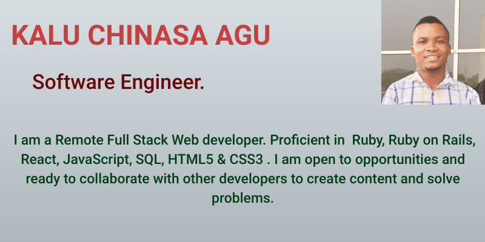

## Hi there, I am Chinasa - aka [Nasa]👋

[][twitter]
[][linkedin]
[][portfolio]

<!--  -->

## I am a software Engineer
- 🔭 I’m currently working on some interesting projects using Html, Css, Bootstrap and Javascript.
- 🌱 I am also learning Python.
- 👯 I am looking to collaborate on other open source projects.
- 💬 Ask me about web devolopment.
- 📫 You can reach me on twitter @Ultimate_nasa.

[twitter]: https://twitter.com/Ultimate_Nasa
[linkedin]: https://www.linkedin.com/in/kalu-chinasa-agu-a15080103/
[portfolio]: https://chinasa-agu-kalu.netlify.app/
